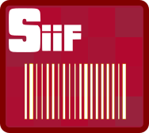
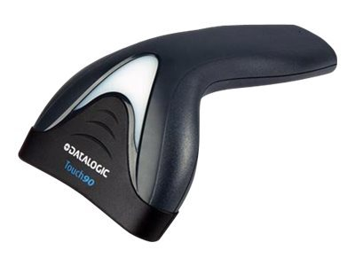
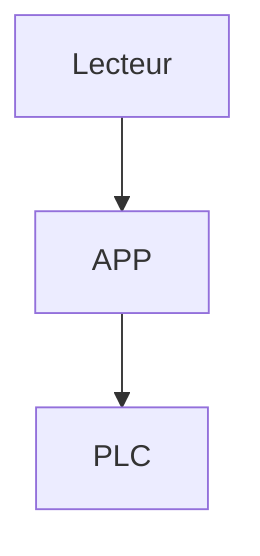
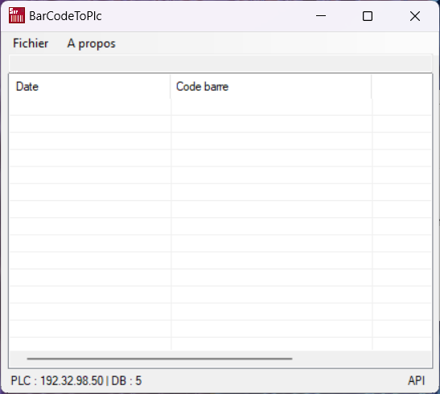
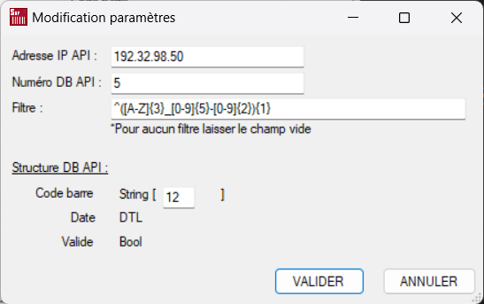

# BarCodeToPlc

<!-- LOGO -->
<!--

  

--!>

BarcodeToPlc est une application Windows pour intégrer un lecteur de code barre USB Datalogic TouchLite-i-TD1120 avec un automate Siemens
<!-- TD1120 -->

 
  </a>

> [!NOTE]
> Il est nécessaire de configurer la douchette avec le logiciel DataLogic Alladin ➡️ [Site Datalogic](https://aladdin.datalogic.com/#/configuration/home)

> [!WARNING]
> Uniquement testé avec une douchette Datalogic TouchLite-i-TD1120

## 1 - TELECHARGER

Télécharger l'installateur➡️ [Setup](https://github.com/tonycab/BarCodeToPlc/releases/tag/v0.0.6)

Configurer la douchette avec le logiciel Aladdin Datalogic et avec le fichier de configuration.➡️ [CONF]( https://github.com/tonycab/BarCodeToPlc/tree/main/Config%20TouchLite%20TD1120)

## 2 - COMMENCER

Exécuter l'application

<!-- APP -->

  

## 3 - PARAMETRAGE
<!-- CONF -->

  

| Paramètre | Détail|
|-----------|---------------------------------|
|Adresse IP | Adresse IP de l'automate Siemens |
|Numero de DB | Numero de DB (Non Optimisé) |
|Filtre | Filtre regex C# pour accepter des codes barres spécifique |

Le DB doit avoir la structure ci-dessous :
| Type | Commentaire|
|-----------|---------------------------------|
|STRING | Code barre |
|DTL | horodatage du scan |
|BOOL | Code barre valide par le Regex |

## 4 - AMELIORATION A FAIRE

- [x] Ajout d'un filtre Regex
- [x] Ajout d'un logger
- [ ] Etendre l'application à d'autres lecteurs de code barre

## 5 - INFORMATION
> [!NOTE]
> L'application utilise SHARP7 pour communiquer avec l'automate Siemens. Il est nécessaire d'activer la fonction GET/PUT dans l'automate et que le DB ne soit pas optimisé

(<a href="#readme-top">Back to top</a>)

